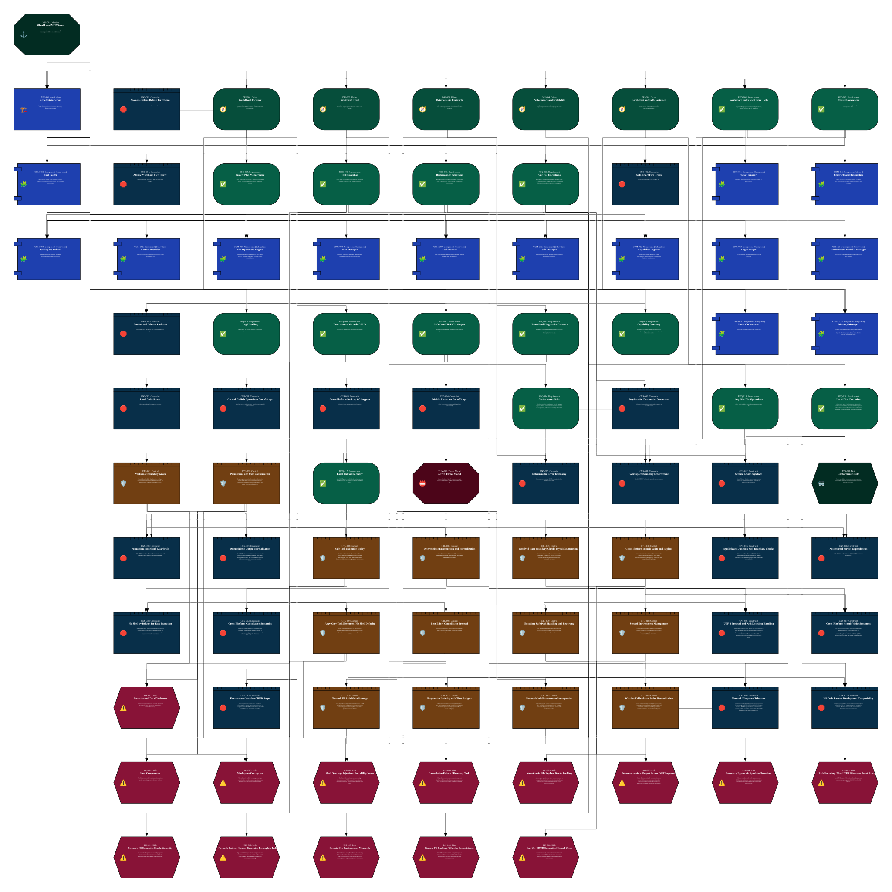
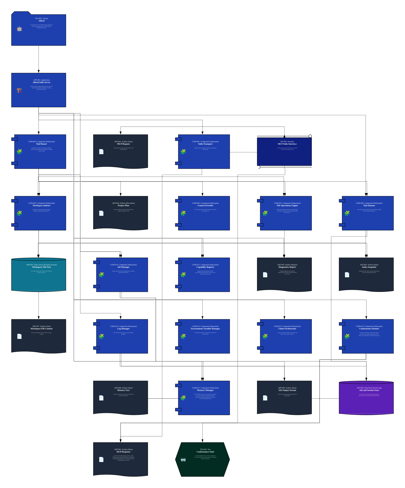
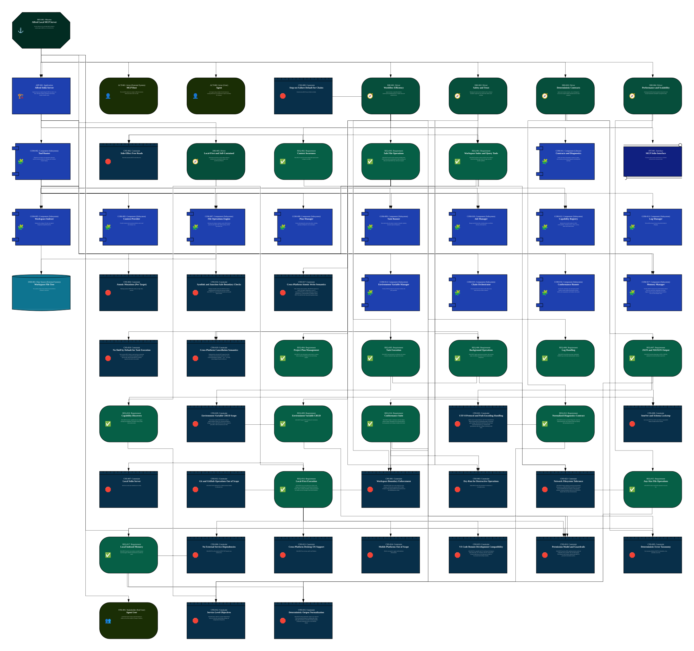
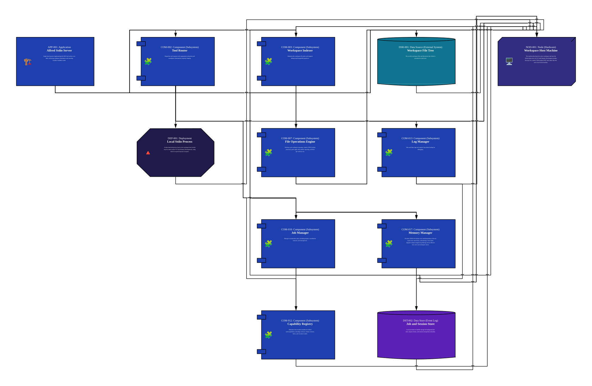
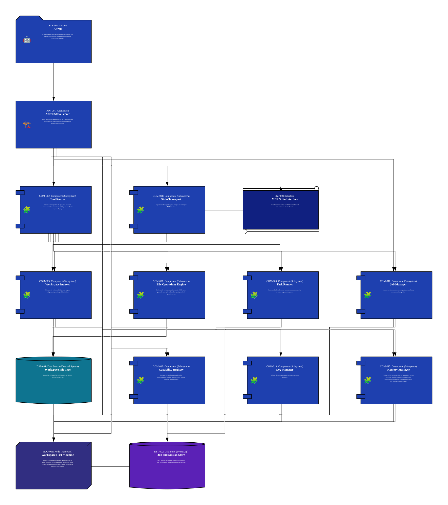
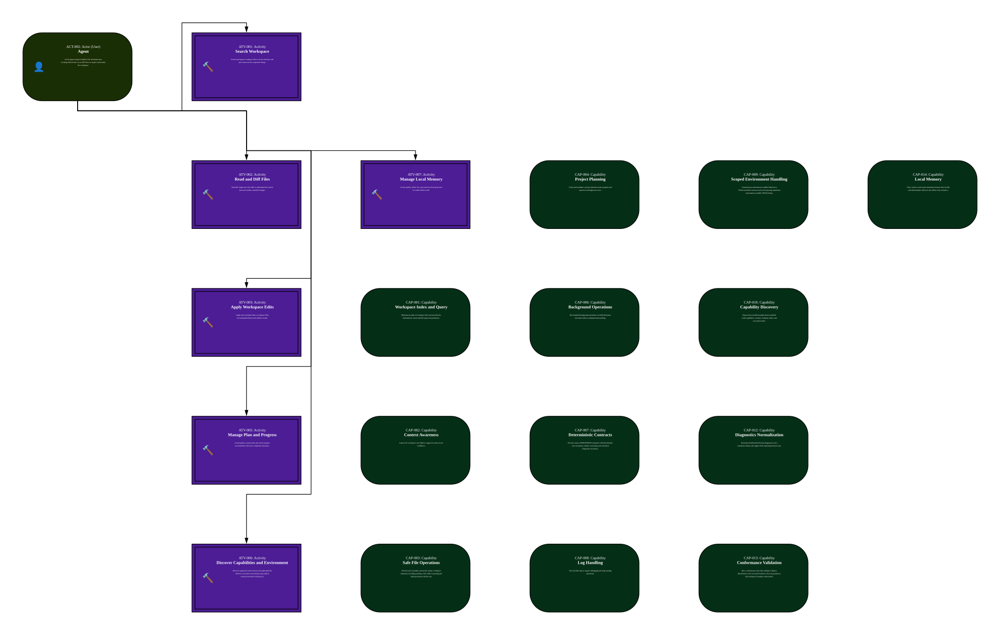
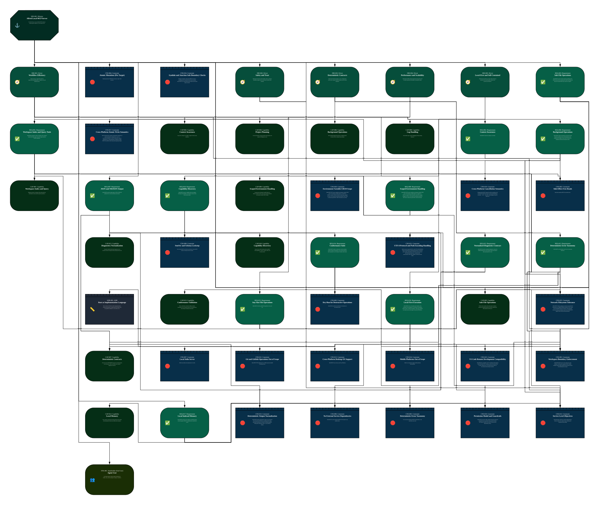
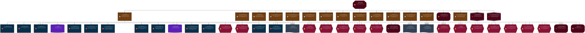
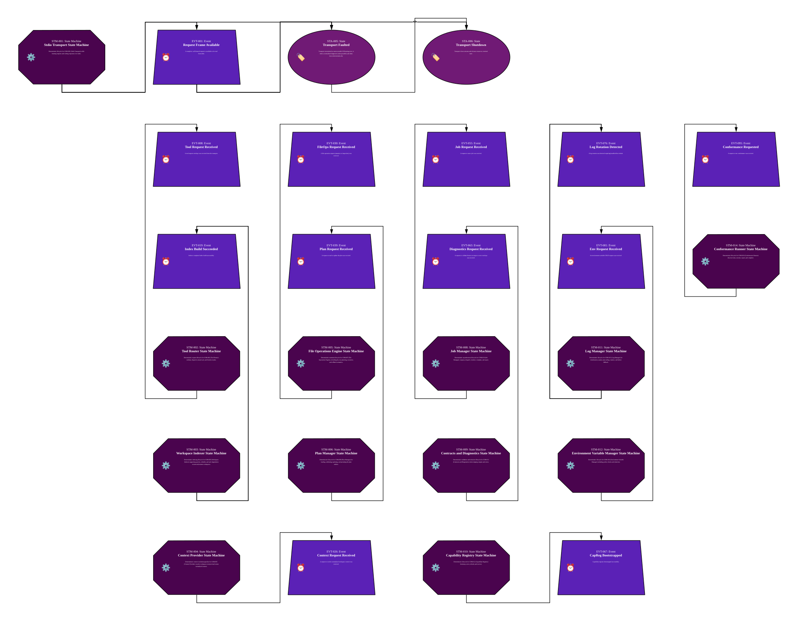
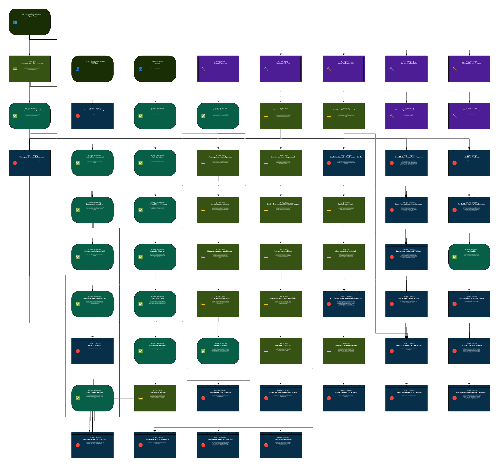

# MIS-001: Alfred Local MCP Server

**[Mission Card](MIS-001-Alfred_Local_MCP_Server.md)**

Provide efficient, safe, and reliable MCP tooling for common agent workflows as a local stdio server.

## Views

## Card Index

### ADR

- **[ADR-001 - Rust as Implementation Language](MIS-001/ADR/ADR-001-Rust_as_Implementation_Language.md)**: Rust is chosen for Alfred to achieve high performance, strong safety guarantees, implementation flexibility, and cross-platform usability for a local stdio server.

### Activity

- **[ATV-002 - Read and Diff Files](MIS-001/Activity/ATV-002-Read_and_Diff_Files.md)**: Read file ranges and view diffs to understand the current state and validate intended changes.

- **[ATV-001 - Search Workspace](MIS-001/Activity/ATV-001-Search_Workspace.md)**: Search and inspect workspace files to locate relevant code and context for a task.

- **[ATV-005 - Manage Plan and Progress](MIS-001/Activity/ATV-005-Manage_Plan_and_Progress.md)**: Create/update a task plan and report progress incrementally with clear completion semantics.

- **[ATV-006 - Discover Capabilities and Environment](MIS-001/Activity/ATV-006-Discover_Capabilities_and_Environment.md)**: Discover supported tools/versions and understand the effective execution environment (especially in remote/networked workspaces).

- **[ATV-004 - Run and Monitor Tasks](MIS-001/Activity/ATV-004-Run_and_Monitor_Tasks.md)**: Run local processes, stream logs, and cancel/timeout work when needed.

- **[ATV-003 - Apply Workspace Edits](MIS-001/Activity/ATV-003-Apply_Workspace_Edits.md)**: Apply safe, bounded edits to workspace files (create/update/delete) and validate results.

- **[ATV-007 - Manage Local Memory](MIS-001/Activity/ATV-007-Manage_Local_Memory.md)**: Create, update, delete, list, and search local memory facts for stable offline recall.

### Actor

- **[ACT-002 - Agent](MIS-001/Actor/ACT-002-Agent.md)**: An AI agent acting on behalf of the developer/user, invoking Alfred tools via an MCP host to inspect and modify the workspace.

- **[ACT-001 - MCP Host](MIS-001/Actor/ACT-001-MCP_Host.md)**: The local MCP runtime (for example an IDE) that launches Alfred and calls its tools over stdio.

### Adversary

- **[ADV-001 - Malicious or Compromised Agent](MIS-001/Adversary/ADV-001-Malicious_or_Compromised_Agent.md)**: An agent/client that is intentionally malicious or has been compromised (prompt-injected), attempting forbidden actions such as reading outside the workspace or executing dangerous commands.

### Application

- **[APP-001 - Alfred Stdio Server](MIS-001/Application/APP-001-Alfred_Stdio_Server.md)**: Single local process implementing the MCP tool surface over stdio, enforcing workspace boundaries and returning machine-readable results.

### Artifact

- **[ART-001 - MCP Request](MIS-001/Artifact/ART-001-MCP_Request.md)**: A structured tool invocation request received over stdio from the MCP host.

- **[ART-007 - Workspace File Content](MIS-001/Artifact/ART-007-Workspace_File_Content.md)**: File bytes and metadata read from within the workspace boundary.

- **[ART-008 - Memory Fact](MIS-001/Artifact/ART-008-Memory_Fact.md)**: A single structured memory entry persisted by Alfred for offline recall and search.

- **[ART-006 - Job Output Stream](MIS-001/Artifact/ART-006-Job_Output_Stream.md)**: A stream of output chunks and structured status for a background job.

- **[ART-003 - Diagnostics Report](MIS-001/Artifact/ART-003-Diagnostics_Report.md)**: Normalized diagnostics output emitted by build/test/lint/format tooling, optionally with deltas between runs.

- **[ART-004 - Project Plan](MIS-001/Artifact/ART-004-Project_Plan.md)**: A persistent Markdown plan artifact tracking the agent's progress and planned work items.

- **[ART-005 - Index Snapshot](MIS-001/Artifact/ART-005-Index_Snapshot.md)**: Serialized index state used to accelerate repeated queries and reduce redundant filesystem scans.

- **[ART-002 - MCP Response](MIS-001/Artifact/ART-002-MCP_Response.md)**: A structured tool result returned over stdio as a single JSON frame. Large result sets SHOULD be carried either as bounded JSON arrays/objects, or by returning a job id and streaming NDJSON via job tools.

### Asset

- **[AST-003 - Non-workspace Resources](MIS-001/Asset/AST-003-Nonworkspace_Resources.md)**: Resources outside the workspace boundary that must remain protected: non-workspace filesystem paths, the host OS/process space, and local durable state stores (index/job/plan).

- **[AST-001 - Workspace Contents](MIS-001/Asset/AST-001-Workspace_Contents.md)**: Files and directories within the configured workspace boundary, including source code and project configuration.

- **[AST-002 - Secrets and Credentials](MIS-001/Asset/AST-002-Secrets_and_Credentials.md)**: Sensitive values accessible on the developer machine (e.g., API tokens in environment variables or dotfiles, SSH keys, and credentials that may be present in the workspace or user profile).

### Capability

- **[CAP-009 - Environment Variable Management](MIS-001/Capability/CAP-009-Environment_Variable_Management.md)**: Support CRUD operations for environment variables used by tools and tasks.

- **[CAP-005 - Task and Tool Execution](MIS-001/Capability/CAP-005-Task_and_Tool_Execution.md)**: Execute named tasks (build/test) and common ecosystem commands (cargo/pnpm/lint/format) with normalized outputs.

- **[CAP-001 - Workspace Index and Query](MIS-001/Capability/CAP-001-Workspace_Index_and_Query.md)**: Maintain an index of workspace files and provide fast listing, search, range extraction, and diff primitives.

- **[CAP-011 - Single-Call Action Chaining](MIS-001/Capability/CAP-011-SingleCall_Action_Chaining.md)**: Execute multi-step actions (e.g. search → patch → validate) in declared order with per-step status and error reporting.

- **[CAP-006 - Background Operations](MIS-001/Capability/CAP-006-Background_Operations.md)**: Run asynchronous operations with streaming output, cancellation, timeouts, and job/session introspection.

- **[CAP-013 - Conformance Validation](MIS-001/Capability/CAP-013-Conformance_Validation.md)**: Run a conformance suite that validates schemas, deterministic error taxonomy behavior, dry-run guarantees, and workspace boundary enforcement.

- **[CAP-003 - Safe File Operations](MIS-001/Capability/CAP-003-Safe_File_Operations.md)**: Perform safe, bounded, and mostly-atomic workspace mutations including patching with conflict reporting, bulk operations with dry-run, and bounded byte-chunk file mutation for binary/any-size files.

- **[CAP-014 - Local Memory](MIS-001/Capability/CAP-014-Local_Memory.md)**: Store, retrieve, and search structured memory facts locally with deterministic behavior and offline-only semantics.

- **[CAP-010 - Capability Discovery](MIS-001/Capability/CAP-010-Capability_Discovery.md)**: Expose discoverable metadata about available tools/capabilities, versions, schemas, limits, and execution modes.

- **[CAP-008 - Log Handling](MIS-001/Capability/CAP-008-Log_Handling.md)**: Tail and filter logs to support debugging and long-running operations.

- **[CAP-004 - Project Planning](MIS-001/Capability/CAP-004-Project_Planning.md)**: Create and maintain a project plan that tracks progress and captures tool/diagnostic errors.

- **[CAP-007 - Deterministic Contracts](MIS-001/Capability/CAP-007-Deterministic_Contracts.md)**: Provide concise JSON/NDJSON responses with deterministic error taxonomy, schema versioning, and consistent diagnostics structures.

- **[CAP-012 - Diagnostics Normalization](MIS-001/Capability/CAP-012-Diagnostics_Normalization.md)**: Normalize build/test/lint/format diagnostics into a consistent schema and support delta reporting between runs.

- **[CAP-002 - Context Awareness](MIS-001/Capability/CAP-002-Context_Awareness.md)**: Expose the current working folder and the workspace root folder to support location-aware workflows.

### Component

- **[COM-009 - Task Runner](MIS-001/Component/COM-009-Task_Runner.md)**: Runs named tasks and common ecosystem commands, capturing structured output and diagnostics.

- **[COM-011 - Contracts and Diagnostics](MIS-001/Component/COM-011-Contracts_and_Diagnostics.md)**: Defines and enforces deterministic schemas for outputs, error taxonomy, and normalized diagnostics (including delta reporting).

- **[COM-002 - Tool Router](MIS-001/Component/COM-002-Tool_Router.md)**: Dispatches tool requests to the appropriate subsystem, enforces execution semantics for chaining, and coordinates response shaping.

- **[COM-014 - Environment Variable Manager](MIS-001/Component/COM-014-Environment_Variable_Manager.md)**: Provides CRUD operations for environment variables with policy guardrails.

- **[COM-005 - Context Provider](MIS-001/Component/COM-005-Context_Provider.md)**: Provides location/context awareness primitives such as pwd and workspace root.

- **[COM-007 - File Operations Engine](MIS-001/Component/COM-007-File_Operations_Engine.md)**: Performs safe workspace mutations: atomic CRUD (where practical), patch apply with conflict reporting, and bulk ops with dry-run.

- **[COM-003 - Workspace Indexer](MIS-001/Component/COM-003-Workspace_Indexer.md)**: Maintains the workspace file index and supports listing/search/range/diff primitives.

- **[COM-012 - Capability Registry](MIS-001/Component/COM-012-Capability_Registry.md)**: Maintains discoverable metadata for Alfred tools/capabilities, including versions, schema versions, limits, and execution modes.

- **[COM-015 - Chain Orchestrator](MIS-001/Component/COM-015-Chain_Orchestrator.md)**: Executes declared action chains in order with per-step status and stop-on-failure semantics.

- **[COM-008 - Plan Manager](MIS-001/Component/COM-008-Plan_Manager.md)**: Creates and maintains the project plan artifact, including capturing tool/diagnostics errors and progress.

- **[COM-016 - Conformance Runner](MIS-001/Component/COM-016-Conformance_Runner.md)**: Executes the conformance suite and reports pass/fail results for schema validity, deterministic taxonomy behavior, dry-run guarantees, and boundary enforcement.

- **[COM-001 - Stdio Transport](MIS-001/Component/COM-001-Stdio_Transport.md)**: Implements stdio request/response transport and framing for MCP tool calls.

- **[COM-017 - Memory Manager](MIS-001/Component/COM-017-Memory_Manager.md)**: Provides CRUD for memory facts and deterministic full-text search over stored facts, maintaining a local index. Supports subject/category/tag filtering and an effective view over user/workspace stores.

- **[COM-010 - Job Manager](MIS-001/Component/COM-010-Job_Manager.md)**: Manages asynchronous jobs, streaming outputs, cancellation, timeouts, and introspection.

- **[COM-013 - Log Manager](MIS-001/Component/COM-013-Log_Manager.md)**: Tails and filters logs and exposes log-related tooling for debugging.

### Constraint

- **[CNS-010 - Permission Model and Guardrails](MIS-001/Constraint/CNS-010-Permission_Model_and_Guardrails.md)**: Alfred MUST provide an IDE-compliant permission model and configurable policy guardrails with reasonable defaults. Tool exposure, task execution, and plan writes MUST be governed by deterministic policies.

- **[CNS-014 - Mobile Platforms Out of Scope](MIS-001/Constraint/CNS-014-Mobile_Platforms_Out_of_Scope.md)**: Alfred is not required to support mobile platforms (iOS/Android).

- **[CNS-009 - Stop-on-Failure Default for Chains](MIS-001/Constraint/CNS-009-StoponFailure_Default_for_Chains.md)**: Chained actions MUST stop on failure by default.

- **[CNS-017 - Cross-Platform Atomic Write Semantics](MIS-001/Constraint/CNS-017-CrossPlatform_Atomic_Write_Semantics.md)**: When claiming atomic mutations, Alfred MUST implement an atomic write/replace strategy that is correct on Linux/macOS/Windows; if atomic replacement cannot be guaranteed (e.g., locked destination on Windows), Alfred MUST fail explicitly rather than partially applying changes.

- **[CNS-005 - Deterministic Error Taxonomy](MIS-001/Constraint/CNS-005-Deterministic_Error_Taxonomy.md)**: Error taxonomy definitions MUST be deterministic, clear, and stable across tools.

- **[CNS-023 - VS Code Remote Development Compatibility](MIS-001/Constraint/CNS-023-VS_Code_Remote_Development_Compatibility.md)**: Alfred MUST be compatible with VS Code Remote Development modes (SSH, WSL, Dev Containers) where the extension host is remote. Alfred runs as a local stdio process relative to the extension host/workspace machine.

- **[CNS-019 - Cross-Platform Cancellation Semantics](MIS-001/Constraint/CNS-019-CrossPlatform_Cancellation_Semantics.md)**: Background jobs and tasks MUST support best-effort cancellation with documented semantics that work on Linux/macOS/Windows (terminate → wait → force kill), acknowledging OS-specific differences.

- **[CNS-001 - Workspace Boundary Enforcement](MIS-001/Constraint/CNS-001-Workspace_Boundary_Enforcement.md)**: Alfred MUST NOT read or write outside the current workspace. All filesystem operations MUST validate workspace-relative paths and MUST prevent path traversal and symlink/junction escapes.

- **[CNS-003 - Dry-Run for Destructive Operations](MIS-001/Constraint/CNS-003-DryRun_for_Destructive_Operations.md)**: Alfred MUST provide dry-run behavior for destructive or irreversible actions.

- **[CNS-022 - Network Filesystem Tolerance](MIS-001/Constraint/CNS-022-Network_Filesystem_Tolerance.md)**: Alfred MUST tolerate workspaces located on network-backed filesystems (e.g., SMB/NFS/SSHFS) and MUST NOT assume strict local-POSIX filesystem semantics; when guarantees (atomicity, locking, timestamps) cannot be met, Alfred MUST degrade safely and report deterministically.

- **[CNS-008 - SemVer and Schema Lockstep](MIS-001/Constraint/CNS-008-SemVer_and_Schema_Lockstep.md)**: Tool versions MUST use SemVer, and schema versions MUST remain in lockstep with tool versions.

- **[CNS-020 - Environment Variable CRUD Scope](MIS-001/Constraint/CNS-020-Environment_Variable_CRUD_Scope.md)**: Environment variable CRUD MUST be scoped to Alfred-controlled contexts (e.g., per-task environment or managed .env files). Alfred MUST NOT claim to mutate the parent IDE or shell environment across OSes.

- **[CNS-011 - Git and GitHub Operations Out of Scope](MIS-001/Constraint/CNS-011-Git_and_GitHub_Operations_Out_of_Scope.md)**: Alfred MUST NOT implement Git or GitHub operations handled by dedicated tools.

- **[CNS-018 - No Shell by Default for Task Execution](MIS-001/Constraint/CNS-018-No_Shell_by_Default_for_Task_Execution.md)**: Task execution MUST default to argv-based process spawning (no shell) to avoid cross-platform quoting differences and injection risks; shell execution MUST be explicitly requested and treated as less portable.

- **[CNS-002 - Side-Effect Free Reads](MIS-001/Constraint/CNS-002-SideEffect_Free_Reads.md)**: Read-only operations MUST be side-effect free.

- **[CNS-013 - Cross-Platform Desktop OS Support](MIS-001/Constraint/CNS-013-CrossPlatform_Desktop_OS_Support.md)**: Alfred MUST run on Linux, macOS, and Windows.

- **[CNS-016 - Symlink and Junction-Safe Boundary Checks](MIS-001/Constraint/CNS-016-Symlink_and_JunctionSafe_Boundary_Checks.md)**: Workspace boundary enforcement MUST be robust to symlinks/junctions and path traversal tricks; boundary checks MUST use canonicalized/resolved paths and treat path inputs as hostile.

- **[CNS-006 - No External Service Dependencies](MIS-001/Constraint/CNS-006-No_External_Service_Dependencies.md)**: Alfred MUST be self-contained and MUST NOT depend on any outside service.

- **[CNS-004 - Atomic Mutations (Per Target)](MIS-001/Constraint/CNS-004-Atomic_Mutations_Per_Target.md)**: Mutating operations SHOULD be atomic per target where practical.

- **[CNS-007 - Local Stdio Server](MIS-001/Constraint/CNS-007-Local_Stdio_Server.md)**: Alfred runs locally and communicates over stdio.

- **[CNS-012 - Service Level Objectives](MIS-001/Constraint/CNS-012-Service_Level_Objectives.md)**: Initial p95 latency objectives constrain implementation choices for discovery, indexed search, patching, and background job introspection.

- **[CNS-015 - Deterministic Output Normalization](MIS-001/Constraint/CNS-015-Deterministic_Output_Normalization.md)**: Alfred MUST produce deterministic outputs across supported OSes (Linux/macOS/Windows), including stable sorting, stable path normalization, and stable formatting regardless of filesystem enumeration order or case-sensitivity defaults.

- **[CNS-021 - UTF-8 Protocol and Path Encoding Handling](MIS-001/Constraint/CNS-021-UTF8_Protocol_and_Path_Encoding_Handling.md)**: Alfred’s protocol outputs MUST be valid UTF-8 JSON/NDJSON. When encountering non-UTF8 filesystem paths or OS-specific path encodings, Alfred MUST handle them safely and report them deterministically (e.g., escaped/encoded representations) rather than crashing or producing invalid JSON.

### Control

- **[CTL-007 - Argv-Only Task Execution (No Shell Default)](MIS-001/Control/CTL-007-ArgvOnly_Task_Execution_No_Shell_Default.md)**: Default to argv-based spawning (no shell) to reduce injection risk and ensure cross-platform behavior; require explicit opt-in for shell execution with clear portability warnings.

- **[CTL-011 - Network FS Safe Write Strategy](MIS-001/Control/CTL-011-Network_FS_Safe_Write_Strategy.md)**: When operating on network-backed workspaces, avoid relying on fragile atomicity/locking assumptions; use conservative write+verify patterns and fail explicitly when safety guarantees cannot be achieved.

- **[CTL-014 - Watcher Fallback and Index Reconciliation](MIS-001/Control/CTL-014-Watcher_Fallback_and_Index_Reconciliation.md)**: Do not rely exclusively on file watching for correctness. Support periodic reconciliation, on-demand reindex, and deterministic invalidation when change visibility is uncertain (common on network/remote workspaces).

- **[CTL-006 - Cross-Platform Atomic Write and Replace](MIS-001/Control/CTL-006-CrossPlatform_Atomic_Write_and_Replace.md)**: Implement atomic writes using temp files + sync + replace semantics appropriate to each OS; detect locked destinations (common on Windows) and fail explicitly rather than partially applying changes.

- **[CTL-005 - Resolved-Path Boundary Checks (Symlinks/Junctions)](MIS-001/Control/CTL-005-ResolvedPath_Boundary_Checks_SymlinksJunctions.md)**: Use resolved/canonical paths for workspace boundary enforcement, accounting for symlinks/junctions and platform-specific path rules; reject ambiguous or unresolvable path inputs.

- **[CTL-009 - Encoding-Safe Path Handling and Reporting](MIS-001/Control/CTL-009-EncodingSafe_Path_Handling_and_Reporting.md)**: Treat filesystem paths as potentially non-UTF8; ensure protocol outputs remain valid UTF-8 JSON by using deterministic escaping/encoding for unrepresentable paths.

- **[CTL-010 - Scoped Environment Management](MIS-001/Control/CTL-010-Scoped_Environment_Management.md)**: Scope environment-variable changes to Alfred-managed contexts (per-task env or managed .env files) and report resulting env deterministically; do not attempt to mutate the parent IDE/shell environment.

- **[CTL-002 - Permissions and User Confirmation](MIS-001/Control/CTL-002-Permissions_and_User_Confirmation.md)**: Require explicit permissions for sensitive tool categories (writes, deletes, patch application, and task execution). Support IDE-compliant prompts and policy defaults that assume the agent may be malicious.

- **[CTL-003 - Safe Task Execution Policy](MIS-001/Control/CTL-003-Safe_Task_Execution_Policy.md)**: Constrain task execution to safe defaults: workspace working directory, environment scrubbing, command allow/deny rules, output limits, timeouts, and a policy that prevents Alfred from becoming a general-purpose remote execution agent.

- **[CTL-008 - Best-Effort Cancellation Protocol](MIS-001/Control/CTL-008-BestEffort_Cancellation_Protocol.md)**: Implement a cross-platform cancellation policy (terminate → wait → force kill) with bounded timeouts and consistent job-state transitions.

- **[CTL-012 - Progressive Indexing with Time Budgets](MIS-001/Control/CTL-012-Progressive_Indexing_with_Time_Budgets.md)**: Support progressive/interruptible indexing and searches with explicit progress reporting, bounded time budgets, and deterministic partial-result signaling (especially for network workspaces).

- **[CTL-004 - Deterministic Enumeration and Normalization](MIS-001/Control/CTL-004-Deterministic_Enumeration_and_Normalization.md)**: Ensure deterministic behavior across OSes by sorting enumerations, normalizing paths consistently, and defining stable output ordering rules.

- **[CTL-001 - Workspace Boundary Guard](MIS-001/Control/CTL-001-Workspace_Boundary_Guard.md)**: Canonicalize and validate all paths; enforce workspace boundary checks; treat symlinks, traversal sequences, and platform-specific path edge-cases as hostile inputs.

- **[CTL-013 - Remote Mode Environment Introspection](MIS-001/Control/CTL-013-Remote_Mode_Environment_Introspection.md)**: Detect and report the effective execution environment (OS, shell availability, toolchain paths) from the workspace host so tasks/diagnostics are interpreted correctly in VS Code remote modes.

### Data Source

- **[DSR-001 - Workspace File Tree](MIS-001/Data_Source/DSR-001-Workspace_File_Tree.md)**: The on-disk workspace files and directories that Alfred is permitted to read/write.

### Data Store

- **[DST-001 - Index Store](MIS-001/Data_Store/DST-001-Index_Store.md)**: Local persistent storage for workspace index state and derived search metadata.

- **[DST-003 - Plan Store](MIS-001/Data_Store/DST-003-Plan_Store.md)**: Local storage for the project plan artifact (including tool/diagnostic failures and progress tracking).

- **[DST-002 - Job and Session Store](MIS-001/Data_Store/DST-002-Job_and_Session_Store.md)**: Local persistent or durable storage for background job state, output streams, and session introspection metadata.

- **[DST-004 - Memory Store](MIS-001/Data_Store/DST-004-Memory_Store.md)**: Local persistent storage for memory facts and their derived search index.

### Deployment

- **[DEP-001 - Local Stdio Process](MIS-001/Deployment/DEP-001-Local_Stdio_Process.md)**: A stdio-launched process local to the workspace host (which may be remote under VS Code Remote Development), using stdio for request/response transport.

### Driver

- **[DRI-005 - Local-First and Self-Contained](MIS-001/Driver/DRI-005-LocalFirst_and_SelfContained.md)**: Alfred must run locally over stdio without relying on external services, and should be usable across macOS/Linux/Windows.

- **[DRI-003 - Deterministic Contracts](MIS-001/Driver/DRI-003-Deterministic_Contracts.md)**: Agents need consistent schemas, errors, and diagnostics across tools to support reliable automation and low-token summaries.

- **[DRI-006 - Offline Agent Memory Reliability](MIS-001/Driver/DRI-006-Offline_Agent_Memory_Reliability.md)**: Agents need a stable, offline-only memory mechanism that remains available even when online or host-provided memory features fail.

- **[DRI-002 - Safety and Trust](MIS-001/Driver/DRI-002-Safety_and_Trust.md)**: Mutating tools must be safe by default: enforce workspace boundaries, support dry-run, and provide conflict-aware patching.

- **[DRI-001 - Workflow Efficiency](MIS-001/Driver/DRI-001-Workflow_Efficiency.md)**: Agents need fast, composable primitives (index/search/read/diff/patch/run) to complete tasks with minimal friction.

- **[DRI-004 - Performance and Scalability](MIS-001/Driver/DRI-004-Performance_and_Scalability.md)**: Indexing/search/diff and patch operations must perform well on typical repositories and handle very large files safely.

### Event

- **[EVT-052 - Task Run Failed](MIS-001/Event/EVT-052-Task_Run_Failed.md)**: Task execution failed before a complete report could be produced.

- **[EVT-004 - Frame Parsed OK](MIS-001/Event/EVT-004-Frame_Parsed_OK.md)**: The incoming frame was parsed successfully into a request envelope.

- **[EVT-099 - Conformance Run Failed](MIS-001/Event/EVT-099-Conformance_Run_Failed.md)**: Conformance execution failed.

- **[EVT-109 - Transport Initialized](MIS-001/Event/EVT-109-Transport_Initialized.md)**: Stdio transport initialization completed and the transport can begin reading frames.

- **[EVT-025 - Manual Rebuild Requested](MIS-001/Event/EVT-025-Manual_Rebuild_Requested.md)**: An explicit request was made to rebuild/reconcile the index.

- **[EVT-042 - Plan Validated](MIS-001/Event/EVT-042-Plan_Validated.md)**: Plan schema/lockstep validation succeeded.

- **[EVT-114 - Diagnostics Failure Emitted](MIS-001/Event/EVT-114-Diagnostics_Failure_Emitted.md)**: Diagnostics emitted the minimal deterministic error envelope and finalized the response.

- **[EVT-085 - Env Failure Reported](MIS-001/Event/EVT-085-Env_Failure_Reported.md)**: A deterministic environment-variable error was reported.

- **[EVT-022 - Indexer Fault Detected](MIS-001/Event/EVT-022-Indexer_Fault_Detected.md)**: Indexer detected an unrecoverable fault while serving or monitoring the index.

- **[EVT-104 - Plan Failure Reported](MIS-001/Event/EVT-104-Plan_Failure_Reported.md)**: A deterministic plan manager failure was reported.

- **[EVT-076 - Log Rotation Detected](MIS-001/Event/EVT-076-Log_Rotation_Detected.md)**: A log rotation was detected requiring handle/offset refresh.

- **[EVT-072 - CapReg Fault Detected](MIS-001/Event/EVT-072-CapReg_Fault_Detected.md)**: Capability registry detected an unrecoverable fault.

- **[EVT-035 - Execution Requires Rollback](MIS-001/Event/EVT-035-Execution_Requires_Rollback.md)**: Execution partially completed and requires compensating actions.

- **[EVT-093 - Chain Completed Reported](MIS-001/Event/EVT-093-Chain_Completed_Reported.md)**: Chain completion status was reported deterministically.

- **[EVT-078 - Rotation Handled](MIS-001/Event/EVT-078-Rotation_Handled.md)**: Rotation was handled and tailing can resume.

- **[EVT-070 - CapReg Refresh Succeeded](MIS-001/Event/EVT-070-CapReg_Refresh_Succeeded.md)**: Capability registry refresh succeeded.

- **[EVT-032 - Plan Validated For Dry-Run](MIS-001/Event/EVT-032-Plan_Validated_For_DryRun.md)**: The plan validated successfully and dry-run mode was requested (no writes).

- **[EVT-002 - Shutdown Requested](MIS-001/Event/EVT-002-Shutdown_Requested.md)**: A shutdown was requested (EOF, host termination, or explicit stop).

- **[EVT-054 - Task Result Emitted](MIS-001/Event/EVT-054-Task_Result_Emitted.md)**: Task result (success or failure) was emitted deterministically.

- **[EVT-059 - Job Dispatch Failed](MIS-001/Event/EVT-059-Job_Dispatch_Failed.md)**: Job dispatch failed and cannot start monitoring.

- **[EVT-015 - Response Finalized](MIS-001/Event/EVT-015-Response_Finalized.md)**: The router finalized the success response envelope and released resources.

- **[EVT-069 - CapReg Refresh Requested](MIS-001/Event/EVT-069-CapReg_Refresh_Requested.md)**: Capability registry refresh was requested.

- **[EVT-096 - Conformance Tests Selected](MIS-001/Event/EVT-096-Conformance_Tests_Selected.md)**: Deterministic test set selected for the current versions.

- **[EVT-071 - CapReg Refresh Failed](MIS-001/Event/EVT-071-CapReg_Refresh_Failed.md)**: Capability registry refresh failed.

- **[EVT-037 - Rollback Completed](MIS-001/Event/EVT-037-Rollback_Completed.md)**: Compensating actions completed.

- **[EVT-107 - Chain Stop Failed](MIS-001/Event/EVT-107-Chain_Stop_Failed.md)**: Chain stop/cancel handling failed and the chain must transition to deterministic failure reporting.

- **[EVT-079 - Rotation Failed](MIS-001/Event/EVT-079-Rotation_Failed.md)**: Handling rotation failed.

- **[EVT-053 - Task Canceled](MIS-001/Event/EVT-053-Task_Canceled.md)**: Task cancellation completed and the terminal status is ready for reporting.

- **[EVT-065 - Diagnostics Invalid](MIS-001/Event/EVT-065-Diagnostics_Invalid.md)**: Envelope did not validate and must be converted to a deterministic internal error.

- **[EVT-061 - Job Failed](MIS-001/Event/EVT-061-Job_Failed.md)**: Job failed (timeout, cancellation, or runtime error).

- **[EVT-086 - Chain Request Received](MIS-001/Event/EVT-086-Chain_Request_Received.md)**: A chain execution request was received.

- **[EVT-089 - Steps Completed](MIS-001/Event/EVT-089-Steps_Completed.md)**: All chain steps completed successfully.

- **[EVT-067 - CapReg Bootstrapped](MIS-001/Event/EVT-067-CapReg_Bootstrapped.md)**: Capability registry bootstrapped successfully.

- **[EVT-108 - Task Cancel Failed](MIS-001/Event/EVT-108-Task_Cancel_Failed.md)**: Task cancellation failed and the task runner must transition to deterministic failure reporting.

- **[EVT-090 - Stop Requested](MIS-001/Event/EVT-090-Stop_Requested.md)**: A stop/cancel request was received for the chain.

- **[EVT-051 - Task Cancel Requested](MIS-001/Event/EVT-051-Task_Cancel_Requested.md)**: Cancellation was requested for the running task.

- **[EVT-049 - Task Preparation Failed](MIS-001/Event/EVT-049-Task_Preparation_Failed.md)**: Task preparation failed due to invalid inputs, boundary issues, or missing tools.

- **[EVT-095 - Conformance Requested](MIS-001/Event/EVT-095-Conformance_Requested.md)**: A request to run conformance was received.

- **[EVT-097 - Conformance Discovery Failed](MIS-001/Event/EVT-097-Conformance_Discovery_Failed.md)**: Conformance test selection/discovery failed.

- **[EVT-064 - Diagnostics Validated](MIS-001/Event/EVT-064-Diagnostics_Validated.md)**: Envelope validated against deterministic schema and taxonomy.

- **[EVT-068 - CapReg Bootstrap Failed](MIS-001/Event/EVT-068-CapReg_Bootstrap_Failed.md)**: Capability registry bootstrap failed.

- **[EVT-045 - Plan Request Completed](MIS-001/Event/EVT-045-Plan_Request_Completed.md)**: The plan read/update request completed and the response was finalized.

- **[EVT-082 - Env Policy Accepted](MIS-001/Event/EVT-082-Env_Policy_Accepted.md)**: Policy checks succeeded and an output is ready for deterministic redaction.

- **[EVT-077 - Log Fault Detected](MIS-001/Event/EVT-077-Log_Fault_Detected.md)**: Log Manager detected an unrecoverable fault.

- **[EVT-010 - Request Rejected](MIS-001/Event/EVT-010-Request_Rejected.md)**: The router rejected the request due to schema, policy, or boundary violations.

- **[EVT-031 - Plan Validated For Execution](MIS-001/Event/EVT-031-Plan_Validated_For_Execution.md)**: The mutation plan validated successfully and execution is requested.

- **[EVT-094 - Chain Failure Reported](MIS-001/Event/EVT-094-Chain_Failure_Reported.md)**: Chain failure was reported deterministically.

- **[EVT-073 - CapReg Recovery Requested](MIS-001/Event/EVT-073-CapReg_Recovery_Requested.md)**: Recovery was requested for the capability registry.

- **[EVT-018 - Indexer Init Failed](MIS-001/Event/EVT-018-Indexer_Init_Failed.md)**: Indexer failed to initialize configuration or workspace enumeration prerequisites.

- **[EVT-007 - Response Write Failed](MIS-001/Event/EVT-007-Response_Write_Failed.md)**: Writing the response failed (broken pipe, permission, or other IO error).

- **[EVT-039 - Plan Request Received](MIS-001/Event/EVT-039-Plan_Request_Received.md)**: A request to read or update the plan was received.

- **[EVT-024 - Rebuild Failed](MIS-001/Event/EVT-024-Rebuild_Failed.md)**: Indexer failed during rebuild/reconciliation.

- **[EVT-014 - Operation Failed](MIS-001/Event/EVT-014-Operation_Failed.md)**: The dispatched operation failed (deterministic taxonomy error).

- **[EVT-003 - Transport IO Error](MIS-001/Event/EVT-003-Transport_IO_Error.md)**: An unrecoverable IO error occurred while reading/writing stdio.

- **[EVT-012 - Dispatch Failed](MIS-001/Event/EVT-012-Dispatch_Failed.md)**: The router failed to dispatch to the subsystem (unknown tool, internal error, or policy violation).

- **[EVT-103 - Conformance Failed Reported](MIS-001/Event/EVT-103-Conformance_Failed_Reported.md)**: Conformance failure was reported deterministically.

- **[EVT-038 - FileOps Failure Reported](MIS-001/Event/EVT-038-FileOps_Failure_Reported.md)**: A deterministic file-ops failure was reported to the caller.

- **[EVT-081 - Env Request Received](MIS-001/Event/EVT-081-Env_Request_Received.md)**: An environment variable CRUD request was received.

- **[EVT-101 - Conformance Report Failed](MIS-001/Event/EVT-101-Conformance_Report_Failed.md)**: Conformance report emission failed.

- **[EVT-009 - Request Validated](MIS-001/Event/EVT-009-Request_Validated.md)**: The router validated the request (tool name, args, permissions, execution mode constraints).

- **[EVT-008 - Tool Request Received](MIS-001/Event/EVT-008-Tool_Request_Received.md)**: A tool request envelope was received from the transport.

- **[EVT-001 - Request Frame Available](MIS-001/Event/EVT-001-Request_Frame_Available.md)**: A complete, well-framed request is available to be read from stdin.

- **[EVT-048 - Task Prepared](MIS-001/Event/EVT-048-Task_Prepared.md)**: Task invocation was prepared successfully (cwd/env resolved, command normalized).

- **[EVT-041 - Plan Load Failed](MIS-001/Event/EVT-041-Plan_Load_Failed.md)**: Plan artifact could not be loaded.

- **[EVT-006 - Response Write OK](MIS-001/Event/EVT-006-Response_Write_OK.md)**: A single framed response was written successfully.

- **[EVT-056 - Job Enqueued](MIS-001/Event/EVT-056-Job_Enqueued.md)**: Job request validated and enqueued successfully.

- **[EVT-111 - FileOps Commit Finalized](MIS-001/Event/EVT-111-FileOps_Commit_Finalized.md)**: File operations commit/dry-run summary finalized and returned.

- **[EVT-105 - Plan Save Failed](MIS-001/Event/EVT-105-Plan_Save_Failed.md)**: Plan save failed (IO error, permission issue, or atomic write failure).

- **[EVT-013 - Operation Completed](MIS-001/Event/EVT-013-Operation_Completed.md)**: The dispatched operation completed successfully.

- **[EVT-030 - FileOps Request Received](MIS-001/Event/EVT-030-FileOps_Request_Received.md)**: A file operation request (mutation or inspection) was received.

- **[EVT-074 - Log Sources Initialized](MIS-001/Event/EVT-074-Log_Sources_Initialized.md)**: Log sources initialized successfully.

- **[EVT-028 - Context Resolve Failed](MIS-001/Event/EVT-028-Context_Resolve_Failed.md)**: Workspace context could not be resolved (boundary violation, IO error, or remote-host mismatch).

- **[EVT-019 - Index Build Succeeded](MIS-001/Event/EVT-019-Index_Build_Succeeded.md)**: Indexer completed index build successfully.

- **[EVT-063 - Diagnostics Request Received](MIS-001/Event/EVT-063-Diagnostics_Request_Received.md)**: A request to validate/format an output or error envelope was received.

- **[EVT-060 - Job Completed](MIS-001/Event/EVT-060-Job_Completed.md)**: Job completed successfully and is ready for finalization.

- **[EVT-088 - Chain Build Failed](MIS-001/Event/EVT-088-Chain_Build_Failed.md)**: Chain could not be built (invalid declaration, policy violation, or missing tools).

- **[EVT-110 - Transport Shutdown Completed](MIS-001/Event/EVT-110-Transport_Shutdown_Completed.md)**: Transport completed fault handling and transitioned to a deterministic shutdown.

- **[EVT-017 - Initial Build Required](MIS-001/Event/EVT-017-Initial_Build_Required.md)**: Indexer determined an initial index build/rebuild is required.

- **[EVT-075 - Log Init Failed](MIS-001/Event/EVT-075-Log_Init_Failed.md)**: Log Manager failed to initialize log sources.

- **[EVT-084 - Env Response Redacted](MIS-001/Event/EVT-084-Env_Response_Redacted.md)**: Response was redacted deterministically and is ready to return.

- **[EVT-091 - Step Failed](MIS-001/Event/EVT-091-Step_Failed.md)**: A chain step failed; stop-on-failure requires termination.

- **[EVT-016 - Failure Reported](MIS-001/Event/EVT-016-Failure_Reported.md)**: The router emitted a deterministic error response envelope.

- **[EVT-046 - Plan Save Completed](MIS-001/Event/EVT-046-Plan_Save_Completed.md)**: Plan save completed successfully.

- **[EVT-062 - Job Record Written](MIS-001/Event/EVT-062-Job_Record_Written.md)**: Job completion record written and response finalized.

- **[EVT-058 - Job Dispatched](MIS-001/Event/EVT-058-Job_Dispatched.md)**: Job worker started successfully and monitoring commenced.

- **[EVT-112 - Task Failure Reported](MIS-001/Event/EVT-112-Task_Failure_Reported.md)**: Task failure was emitted deterministically to the caller.

- **[EVT-027 - Context Resolved](MIS-001/Event/EVT-027-Context_Resolved.md)**: Workspace context was resolved successfully into normalized paths/values.

- **[EVT-113 - Job Failure Reported](MIS-001/Event/EVT-113-Job_Failure_Reported.md)**: Job failure was emitted deterministically to the caller.

- **[EVT-033 - Plan Rejected](MIS-001/Event/EVT-033-Plan_Rejected.md)**: Plan validation failed due to conflicts, boundary violations, or policy.

- **[EVT-011 - Dispatch Succeeded](MIS-001/Event/EVT-011-Dispatch_Succeeded.md)**: The router dispatched the request to the selected subsystem successfully.

- **[EVT-047 - Task Request Received](MIS-001/Event/EVT-047-Task_Request_Received.md)**: A task execution request was received.

- **[EVT-055 - Job Request Received](MIS-001/Event/EVT-055-Job_Request_Received.md)**: A request to start a job was received.

- **[EVT-040 - Plan Loaded](MIS-001/Event/EVT-040-Plan_Loaded.md)**: Plan artifact loaded successfully.

- **[EVT-087 - Chain Built](MIS-001/Event/EVT-087-Chain_Built.md)**: Chain validated and expanded into a deterministic step list.

- **[EVT-034 - Execution Succeeded](MIS-001/Event/EVT-034-Execution_Succeeded.md)**: Plan execution succeeded and is ready to be committed/summarized.

- **[EVT-043 - Plan Validation Failed](MIS-001/Event/EVT-043-Plan_Validation_Failed.md)**: Plan validation failed (schema mismatch, corrupted artifact, or lockstep violation).

- **[EVT-050 - Task Run Completed](MIS-001/Event/EVT-050-Task_Run_Completed.md)**: Task execution completed and is ready for reporting.

- **[EVT-066 - Diagnostics Emission Complete](MIS-001/Event/EVT-066-Diagnostics_Emission_Complete.md)**: Diagnostics emission completed and response finalized.

- **[EVT-106 - Rollback Failed](MIS-001/Event/EVT-106-Rollback_Failed.md)**: Rollback/compensation failed and deterministic failure reporting is required.

- **[EVT-021 - Rebuild Scheduled](MIS-001/Event/EVT-021-Rebuild_Scheduled.md)**: Indexer scheduled a rebuild/reconciliation due to detected change, staleness, or explicit request.

- **[EVT-102 - Conformance Completed](MIS-001/Event/EVT-102-Conformance_Completed.md)**: Conformance run completed and terminal status is ready to return.

- **[EVT-092 - Chain Stopped](MIS-001/Event/EVT-092-Chain_Stopped.md)**: Chain stopping completed and status is ready to finalize.

- **[EVT-044 - Plan Update Requested](MIS-001/Event/EVT-044-Plan_Update_Requested.md)**: A deterministic plan update was requested.

- **[EVT-080 - Log Recovered](MIS-001/Event/EVT-080-Log_Recovered.md)**: Log Manager recovered sufficiently to serve requests again.

- **[EVT-083 - Env Policy Rejected](MIS-001/Event/EVT-083-Env_Policy_Rejected.md)**: Policy checks rejected the request.

- **[EVT-029 - Context Failure Reported](MIS-001/Event/EVT-029-Context_Failure_Reported.md)**: A deterministic context error was reported to the caller.

- **[EVT-026 - Context Request Received](MIS-001/Event/EVT-026-Context_Request_Received.md)**: A request to resolve normalized workspace context was received.

- **[EVT-057 - Job Enqueue Failed](MIS-001/Event/EVT-057-Job_Enqueue_Failed.md)**: Job enqueue failed due to invalid inputs or internal errors.

- **[EVT-005 - Frame Malformed](MIS-001/Event/EVT-005-Frame_Malformed.md)**: The incoming frame was malformed or violated framing rules.

- **[EVT-020 - Index Build Failed](MIS-001/Event/EVT-020-Index_Build_Failed.md)**: Indexer failed during index build.

- **[EVT-023 - Rebuild Succeeded](MIS-001/Event/EVT-023-Rebuild_Succeeded.md)**: Indexer completed rebuild/reconciliation successfully.

- **[EVT-036 - Execution Failed](MIS-001/Event/EVT-036-Execution_Failed.md)**: Execution failed and no safe rollback is possible (or rollback already failed).

- **[EVT-100 - Conformance Report Written](MIS-001/Event/EVT-100-Conformance_Report_Written.md)**: Conformance report written successfully.

- **[EVT-098 - Conformance Run Completed](MIS-001/Event/EVT-098-Conformance_Run_Completed.md)**: Conformance execution completed and is ready for reporting.

### Feature

- **[FEA-009 - Environment Variable Tooling](MIS-001/Feature/FEA-009-Environment_Variable_Tooling.md)**: CRUD operations for environment variables with policy guardrails.

- **[FEA-005 - Task Execution Tooling](MIS-001/Feature/FEA-005-Task_Execution_Tooling.md)**: Run named tasks and common commands (cargo/pnpm/lint/format) with normalized outputs.

- **[FEA-007 - Deterministic Response Contracts](MIS-001/Feature/FEA-007-Deterministic_Response_Contracts.md)**: Return concise JSON/NDJSON responses with stable schema versions and deterministic error taxonomy.

- **[FEA-002 - Context Tools](MIS-001/Feature/FEA-002-Context_Tools.md)**: Expose pwd and workspace root primitives for location-aware workflows.

- **[FEA-008 - Log Tailing and Filtering](MIS-001/Feature/FEA-008-Log_Tailing_and_Filtering.md)**: Tail and filter tool/runtime logs for debugging and monitoring long-running operations.

- **[FEA-014 - Local Indexed Memory Tooling](MIS-001/Feature/FEA-014-Local_Indexed_Memory_Tooling.md)**: CRUD and full-text search tools for persistent local memory facts, backed by an index for fast recall.

- **[FEA-006 - Background Job Control](MIS-001/Feature/FEA-006-Background_Job_Control.md)**: Asynchronous job execution with streaming output, cancellation/timeouts, and job/session introspection.

- **[FEA-011 - Action Chaining Orchestration](MIS-001/Feature/FEA-011-Action_Chaining_Orchestration.md)**: Execute multi-step tool chains with ordered execution, per-step status, and stop-on-failure defaults.

- **[FEA-012 - Diagnostics Normalization](MIS-001/Feature/FEA-012-Diagnostics_Normalization.md)**: Normalize diagnostics across build/test/lint/format tooling and support delta reporting.

- **[FEA-001 - Index and Query Tools](MIS-001/Feature/FEA-001-Index_and_Query_Tools.md)**: Provide ls/grep/search/range/diff primitives backed by a workspace index, including deterministic file metadata and bounded byte reads.

- **[FEA-003 - Safe File Mutation Tools](MIS-001/Feature/FEA-003-Safe_File_Mutation_Tools.md)**: Implement atomic CRUD (where practical), patch with conflict reporting, bulk ops with dry-run, and bounded byte-chunk file mutation for binary/any-size files.

- **[FEA-004 - Project Plan Tooling](MIS-001/Feature/FEA-004-Project_Plan_Tooling.md)**: Create and update a project plan capturing progress and tool/diagnostic failures.

- **[FEA-010 - Capability Discovery Endpoint](MIS-001/Feature/FEA-010-Capability_Discovery_Endpoint.md)**: Report available tools and capabilities plus tool/schema versions, limits, and execution modes.

- **[FEA-013 - Conformance Suite Execution](MIS-001/Feature/FEA-013-Conformance_Suite_Execution.md)**: Execute a conformance suite that validates schemas, taxonomy determinism, dry-run guarantees, and workspace boundary enforcement.

### Interface

- **[INT-001 - MCP Stdio Interface](MIS-001/Interface/INT-001-MCP_Stdio_Interface.md)**: The stdio contract used by the MCP host to call Alfred tools and receive structured results.

### Node

- **[NOD-001 - Workspace Host Machine](MIS-001/Node/NOD-001-Workspace_Host_Machine.md)**: The machine that hosts the active workspace and runs the Alfred stdio server. In VS Code Remote Development modes, this may be a remote VM/container/WSL host rather than the user's local client machine.

### Requirement

- **[REQ-014 - Conformance Suite](MIS-001/Requirement/REQ-014-Conformance_Suite.md)**: Alfred MUST include a conformance suite that validates response schemas, deterministic error taxonomy behavior, dry-run guarantees, and workspace boundary enforcement.

- **[REQ-003 - Safe File Operations](MIS-001/Requirement/REQ-003-Safe_File_Operations.md)**: Alfred MUST provide safe file operations including atomic CRUD where practical, patching with conflict reporting, and bulk move/rename/delete/copy with dry-run support.

- **[REQ-013 - Deterministic Error Taxonomy](MIS-001/Requirement/REQ-013-Deterministic_Error_Taxonomy.md)**: Alfred MUST use deterministic and clear error taxonomy definitions.

- **[REQ-016 - Local-First Execution](MIS-001/Requirement/REQ-016-LocalFirst_Execution.md)**: Alfred MUST run as a local stdio server relative to the workspace host (including VS Code Remote Development modes), enforce workspace boundaries, remain self-contained (no outside services), and support Linux/macOS/Windows.

- **[REQ-008 - Log Handling](MIS-001/Requirement/REQ-008-Log_Handling.md)**: Alfred MUST tail and filter logs using a standardized NDJSON log record format and deterministic redaction.

- **[REQ-005 - Task Execution](MIS-001/Requirement/REQ-005-Task_Execution.md)**: Alfred MUST run named tasks (e.g. build/test) and common ecosystem commands (cargo, pnpm, lint, format).

- **[REQ-009 - Environment Variable CRUD](MIS-001/Requirement/REQ-009-Environment_Variable_CRUD.md)**: Alfred MUST support CRUD operations for environment variables.

- **[REQ-006 - Background Operations](MIS-001/Requirement/REQ-006-Background_Operations.md)**: Alfred MUST support asynchronous operations with streaming output, cancellation and timeout controls, and job/session introspection.

- **[REQ-012 - Normalized Diagnostics Contract](MIS-001/Requirement/REQ-012-Normalized_Diagnostics_Contract.md)**: Alfred MUST provide a normalized diagnostics contract for build/test/lint/format, with consistent schema and optional delta reporting between runs.

- **[REQ-017 - Local Indexed Memory](MIS-001/Requirement/REQ-017-Local_Indexed_Memory.md)**: Alfred MUST provide a local, indexed, searchable memory store that supports CRUD for individual facts and full-text search.

- **[REQ-011 - Single-Call Action Chaining](MIS-001/Requirement/REQ-011-SingleCall_Action_Chaining.md)**: Alfred MUST support single-call action chaining (e.g. search → patch → validate) with per-step status and error details.

- **[REQ-001 - Workspace Index and Query Tools](MIS-001/Requirement/REQ-001-Workspace_Index_and_Query_Tools.md)**: Alfred MUST maintain an index of all files in the workspace and provide listing, regex search, file range extraction, and diff capabilities.

- **[REQ-004 - Project Plan Management](MIS-001/Requirement/REQ-004-Project_Plan_Management.md)**: Alfred MUST create and maintain a project plan in a common format, capturing tool/diagnostics errors and tracking progress.

- **[REQ-010 - Capability Discovery](MIS-001/Requirement/REQ-010-Capability_Discovery.md)**: Alfred MUST provide a capability discovery endpoint returning tools/capabilities, tool/schema versions, limits, and execution modes.

- **[REQ-015 - Any-Size File Operations](MIS-001/Requirement/REQ-015-AnySize_File_Operations.md)**: Alfred MUST be able to perform file operations on any size file.

- **[REQ-002 - Context Awareness](MIS-001/Requirement/REQ-002-Context_Awareness.md)**: Alfred MUST return the current working folder (pwd) and the workspace root folder.

- **[REQ-007 - JSON and NDJSON Output](MIS-001/Requirement/REQ-007-JSON_and_NDJSON_Output.md)**: Alfred MUST provide tooling output as JSON or NDJSON, optimized to be concise and token-conservative.

### Resource Owner

- **[ROW-001 - Developer and Workspace Owner](MIS-001/Resource_Owner/ROW-001-Developer_and_Workspace_Owner.md)**: The developer (and their organization) accountable for protecting the workspace, secrets, and the host machine Alfred runs on.

### Risk

- **[RIS-006 - Nondeterministic Output Across OS/Filesystems](MIS-001/Risk/RIS-006-Nondeterministic_Output_Across_OSFilesystems.md)**: Outputs (lists, diagnostics, file enumerations) can vary across OS/filesystems due to enumeration order, case-sensitivity defaults, and path normalization differences, undermining determinism and testability.

- **[RIS-005 - Non-Atomic File Replace Due to Locking](MIS-001/Risk/RIS-005-NonAtomic_File_Replace_Due_to_Locking.md)**: Atomic replace operations may fail or become non-atomic on some platforms (notably Windows when destination files are locked), risking partial writes or inconsistent state if not handled explicitly.

- **[RIS-008 - Cancellation Failure / Runaway Tasks](MIS-001/Risk/RIS-008-Cancellation_Failure_Runaway_Tasks.md)**: OS-specific process termination semantics can prevent timely cancellation of tasks/jobs, causing runaway resource usage or continued execution of an undesired command.

- **[RIS-009 - Path Encoding / Non-UTF8 Filenames Break Protocol](MIS-001/Risk/RIS-009-Path_Encoding_NonUTF8_Filenames_Break_Protocol.md)**: Non-UTF8 filenames or OS-specific path encodings can cause crashes, lossy reporting, or invalid JSON if not handled carefully.

- **[RIS-002 - Host Compromise](MIS-001/Risk/RIS-002-Host_Compromise.md)**: A malicious action results in arbitrary code execution or harmful system changes on the developer machine.

- **[RIS-007 - Shell Quoting / Injection / Portability Issues](MIS-001/Risk/RIS-007-Shell_Quoting_Injection_Portability_Issues.md)**: Shell-based task execution can introduce quoting discrepancies across Windows/macOS/Linux and elevate command-injection risk, especially under a malicious-agent scenario.

- **[RIS-013 - Remote Dev Environment Mismatch](MIS-001/Risk/RIS-013-Remote_Dev_Environment_Mismatch.md)**: In VS Code remote modes, the workspace OS and tooling differ from the user's local machine (e.g., Linux container from Windows client). If Alfred assumes local client OS/tooling, tasks or diagnostics may behave unexpectedly.

- **[RIS-011 - Network FS Semantics Break Atomicity](MIS-001/Risk/RIS-011-Network_FS_Semantics_Break_Atomicity.md)**: Network-backed filesystems may not reliably support the atomic rename/replace semantics assumed by local filesystems, risking partial updates or inconsistent state.

- **[RIS-010 - Env Var CRUD Semantics Mislead Users](MIS-001/Risk/RIS-010-Env_Var_CRUD_Semantics_Mislead_Users.md)**: Users may incorrectly assume environment-variable tools mutate the parent IDE/shell environment. Inconsistent behavior across OSes can lead to confusion or accidental secret exposure.

- **[RIS-014 - Remote FS Caching / Watcher Inconsistency](MIS-001/Risk/RIS-014-Remote_FS_Caching_Watcher_Inconsistency.md)**: Network filesystems and remote development layers can introduce caching or delayed visibility of changes; file watching may be unreliable, causing stale indexes or confusing diff results.

- **[RIS-003 - Workspace Corruption](MIS-001/Risk/RIS-003-Workspace_Corruption.md)**: The workspace is modified in a damaging way (e.g., destructive edits, dependency tampering, or introducing malicious code), causing loss of integrity and trust.

- **[RIS-001 - Unauthorized Data Disclosure](MIS-001/Risk/RIS-001-Unauthorized_Data_Disclosure.md)**: Sensitive workspace data or local secrets are disclosed to an unintended party (e.g., via tool output, logs, or command execution).

- **[RIS-012 - Network Latency Causes Timeouts / Incomplete Indexing](MIS-001/Risk/RIS-012-Network_Latency_Causes_Timeouts_Incomplete_Indexing.md)**: High or variable latency on network workspaces can cause indexing/search to exceed time budgets, produce partial results, or appear non-deterministic without explicit progress/timeout handling.

- **[RIS-004 - Boundary Bypass via Symlinks/Junctions](MIS-001/Risk/RIS-004-Boundary_Bypass_via_SymlinksJunctions.md)**: Workspace boundary checks can be bypassed on some OS/filesystem combinations (e.g., via symlinks/junctions) if checks are performed on untrusted path strings instead of resolved paths.

### Stakeholder

- **[STK-001 - Agent User](MIS-001/Stakeholder/STK-001-Agent_User.md)**: A developer/operator using an agent that depends on reliable, safe, and fast tooling for workspace workflows.

### State

- **[STA-016 - Indexer Rebuilding](MIS-001/State/STA-016-Indexer_Rebuilding.md)**: Indexer performs incremental rebuild or full reconciliation (common on network/remote workspaces) and returns to ready.

- **[STA-053 - Log Initializing](MIS-001/State/STA-053-Log_Initializing.md)**: Log Manager initializes log sources and filtering rules.

- **[STA-071 - Conformance Complete](MIS-001/State/STA-071-Conformance_Complete.md)**: Conformance Runner completes and returns to idle.

- **[STA-064 - Chain Stopping](MIS-001/State/STA-064-Chain_Stopping.md)**: Chain Orchestrator stops execution early due to cancellation or policy and transitions to complete.

- **[STA-009 - Router Dispatching](MIS-001/State/STA-009-Router_Dispatching.md)**: Router dispatches to the appropriate subsystem and establishes response shaping rules.

- **[STA-047 - Diagnostics Emitting](MIS-001/State/STA-047-Diagnostics_Emitting.md)**: Emits normalized, deterministic diagnostics (json/ndjson) and returns to idle.

- **[STA-046 - Diagnostics Validating](MIS-001/State/STA-046-Diagnostics_Validating.md)**: Validates schema and error taxonomy; invalid shapes are converted to deterministic internal errors.

- **[STA-011 - Router Complete](MIS-001/State/STA-011-Router_Complete.md)**: Router finalizes the response envelope and returns to idle.

- **[STA-030 - Plan Ready](MIS-001/State/STA-030-Plan_Ready.md)**: Plan Manager serves reads and accepts deterministic updates.

- **[STA-051 - CapReg Refreshing](MIS-001/State/STA-051-CapReg_Refreshing.md)**: Capability Registry refreshes tool metadata deterministically and returns to ready.

- **[STA-059 - Env Redacting](MIS-001/State/STA-059-Env_Redacting.md)**: Environment Variable Manager redacts secrets deterministically for logs/outputs and returns to ready.

- **[STA-052 - CapReg Failed](MIS-001/State/STA-052-CapReg_Failed.md)**: Capability Registry reports deterministic diagnostics and transitions to bootstrapping for recovery.

- **[STA-050 - CapReg Ready](MIS-001/State/STA-050-CapReg_Ready.md)**: Capability Registry serves capability discovery requests and maintains deterministic metadata.

- **[STA-041 - Job Dispatching](MIS-001/State/STA-041-Job_Dispatching.md)**: Job Manager starts the job worker and establishes output streaming policy.

- **[STA-020 - Context Failed](MIS-001/State/STA-020-Context_Failed.md)**: Context provider failed to resolve context; it reports a deterministic error and returns to ready.

- **[STA-055 - Log Rotating](MIS-001/State/STA-055-Log_Rotating.md)**: Log Manager updates file handles/offsets deterministically after rotation and returns to ready.

- **[STA-029 - Plan Validating](MIS-001/State/STA-029-Plan_Validating.md)**: Plan Manager validates schema version lockstep and deterministic structure.

- **[STA-044 - Job Failed](MIS-001/State/STA-044-Job_Failed.md)**: Job Manager reports deterministic diagnostics and returns to idle.

- **[STA-058 - Env Resolving](MIS-001/State/STA-058-Env_Resolving.md)**: Environment Variable Manager applies policy guardrails and resolves effective values.

- **[STA-054 - Log Ready](MIS-001/State/STA-054-Log_Ready.md)**: Log Manager serves tail/filter requests deterministically.

- **[STA-018 - Context Ready](MIS-001/State/STA-018-Context_Ready.md)**: Context provider is ready to resolve context for a request.

- **[STA-001 - Transport Initializing](MIS-001/State/STA-001-Transport_Initializing.md)**: Transport sets up stdio streams and internal buffers.

- **[STA-035 - Task Running](MIS-001/State/STA-035-Task_Running.md)**: Task Runner executes the command and streams deterministic output (when requested).

- **[STA-032 - Plan Failed](MIS-001/State/STA-032-Plan_Failed.md)**: Plan Manager reports deterministic diagnostics and returns to idle.

- **[STA-042 - Job Monitoring](MIS-001/State/STA-042-Job_Monitoring.md)**: Job Manager tracks job progress, handles cancellation/timeouts, and collects outputs.

- **[STA-063 - Chain Executing](MIS-001/State/STA-063-Chain_Executing.md)**: Chain Orchestrator executes each step in order, reporting per-step deterministic status.

- **[STA-028 - Plan Loading](MIS-001/State/STA-028-Plan_Loading.md)**: Plan Manager loads the plan artifact from the workspace store.

- **[STA-057 - Env Ready](MIS-001/State/STA-057-Env_Ready.md)**: Environment Variable Manager awaits a CRUD request.

- **[STA-033 - Task Idle](MIS-001/State/STA-033-Task_Idle.md)**: Task Runner awaits a task execution request.

- **[STA-005 - Transport Faulted](MIS-001/State/STA-005-Transport_Faulted.md)**: Transport encountered an unrecoverable IO/framing error; it emits a normalized diagnostic (when possible) and shuts down deterministically.

- **[STA-025 - FileOps Rolling Back](MIS-001/State/STA-025-FileOps_Rolling_Back.md)**: File Operations Engine performs deterministic compensating actions for partially-completed plans.

- **[STA-061 - Chain Idle](MIS-001/State/STA-061-Chain_Idle.md)**: Chain Orchestrator awaits a chain execution request.

- **[STA-038 - Task Failed](MIS-001/State/STA-038-Task_Failed.md)**: Task Runner failed before producing a complete result; it emits a deterministic error and returns to idle.

- **[STA-004 - Transport Writing Response](MIS-001/State/STA-004-Transport_Writing_Response.md)**: Transport writes a single framed response to stdout (or NDJSON stream segment), then returns to listening.

- **[STA-007 - Router Idle](MIS-001/State/STA-007-Router_Idle.md)**: Router awaits the next validated framed tool call from the transport.

- **[STA-049 - CapReg Bootstrapping](MIS-001/State/STA-049-CapReg_Bootstrapping.md)**: Capability Registry constructs the initial tool/capability set and validates schema lockstep.

- **[STA-056 - Log Failed](MIS-001/State/STA-056-Log_Failed.md)**: Log Manager reports deterministic diagnostics and falls back to minimal log access if possible.

- **[STA-060 - Env Failed](MIS-001/State/STA-060-Env_Failed.md)**: Environment Variable Manager reports a deterministic policy or IO error and returns to ready.

- **[STA-017 - Indexer Failed](MIS-001/State/STA-017-Indexer_Failed.md)**: Indexer encountered an unrecoverable error; it reports deterministic diagnostics and waits for explicit recovery/rebuild.

- **[STA-031 - Plan Saving](MIS-001/State/STA-031-Plan_Saving.md)**: Plan Manager persists the updated plan artifact atomically where practical and returns to ready.

- **[STA-027 - Plan Idle](MIS-001/State/STA-027-Plan_Idle.md)**: Plan Manager awaits a request to read or update the plan.

- **[STA-069 - Conformance Running](MIS-001/State/STA-069-Conformance_Running.md)**: Conformance Runner executes tests deterministically and records results.

- **[STA-065 - Chain Complete](MIS-001/State/STA-065-Chain_Complete.md)**: Chain Orchestrator finalizes aggregate status and returns to idle.

- **[STA-067 - Conformance Idle](MIS-001/State/STA-067-Conformance_Idle.md)**: Conformance Runner awaits a conformance execution request.

- **[STA-003 - Transport Receiving](MIS-001/State/STA-003-Transport_Receiving.md)**: Transport reads from stdin and assembles a complete framed request; malformed frames transition to faulted.

- **[STA-021 - FileOps Idle](MIS-001/State/STA-021-FileOps_Idle.md)**: File Operations Engine awaits a mutation or inspection request.

- **[STA-048 - Diagnostics Failed](MIS-001/State/STA-048-Diagnostics_Failed.md)**: Contracts and Diagnostics encountered an internal failure and falls back to the minimal deterministic error envelope.

- **[STA-023 - FileOps Executing](MIS-001/State/STA-023-FileOps_Executing.md)**: File Operations Engine executes the approved plan; operations are ordered deterministically.

- **[STA-043 - Job Completing](MIS-001/State/STA-043-Job_Completing.md)**: Job Manager finalizes job status and persists a deterministic completion record, then returns to idle.

- **[STA-006 - Transport Shutdown](MIS-001/State/STA-006-Transport_Shutdown.md)**: Transport closes streams and releases resources; terminal state.

- **[STA-014 - Indexer Building Index](MIS-001/State/STA-014-Indexer_Building_Index.md)**: Indexer enumerates workspace files and builds the derived index.

- **[STA-070 - Conformance Reporting](MIS-001/State/STA-070-Conformance_Reporting.md)**: Conformance Runner emits a deterministic report of pass/fail and evidence.

- **[STA-066 - Chain Failed](MIS-001/State/STA-066-Chain_Failed.md)**: Chain Orchestrator reports deterministic failure details and returns to idle.

- **[STA-040 - Job Enqueuing](MIS-001/State/STA-040-Job_Enqueuing.md)**: Job Manager validates job request and enqueues it for deterministic scheduling.

- **[STA-010 - Router Streaming or Waiting](MIS-001/State/STA-010-Router_Streaming_or_Waiting.md)**: Router streams deterministic output (NDJSON) for long operations or waits for a single response for sync operations.

- **[STA-012 - Router Failed](MIS-001/State/STA-012-Router_Failed.md)**: Router produces a deterministic error response and returns to idle.

- **[STA-022 - FileOps Validating Plan](MIS-001/State/STA-022-FileOps_Validating_Plan.md)**: File Operations Engine validates intent against workspace boundaries, permissions, and conflict rules; produces a deterministic plan.

- **[STA-037 - Task Canceling](MIS-001/State/STA-037-Task_Canceling.md)**: Task Runner attempts a deterministic cancellation (signal/terminate), then reports terminal status.

- **[STA-034 - Task Preparing](MIS-001/State/STA-034-Task_Preparing.md)**: Task Runner validates inputs, resolves context (cwd/env), and builds a deterministic invocation.

- **[STA-019 - Context Resolving](MIS-001/State/STA-019-Context_Resolving.md)**: Context provider resolves workspace root/pwd and returns normalized values.

- **[STA-036 - Task Reporting](MIS-001/State/STA-036-Task_Reporting.md)**: Task Runner finalizes structured output and emits deterministic diagnostics, then returns to idle.

- **[STA-045 - Diagnostics Idle](MIS-001/State/STA-045-Diagnostics_Idle.md)**: Contracts and Diagnostics awaits a request to validate or format an output/error.

- **[STA-024 - FileOps Committing](MIS-001/State/STA-024-FileOps_Committing.md)**: File Operations Engine finalizes writes, flushes, and records a deterministic summary (or no-op summary for dry-run).

- **[STA-062 - Chain Building](MIS-001/State/STA-062-Chain_Building.md)**: Chain Orchestrator validates and expands the declared chain into a deterministic step list.

- **[STA-008 - Router Validating Request](MIS-001/State/STA-008-Router_Validating_Request.md)**: Router validates tool name, arguments, permissions, and execution mode constraints.

- **[STA-015 - Indexer Ready](MIS-001/State/STA-015-Indexer_Ready.md)**: Indexer serves query primitives against the current index and schedules rebuilds when needed.

- **[STA-013 - Indexer Initializing](MIS-001/State/STA-013-Indexer_Initializing.md)**: Indexer loads configuration and determines whether an initial build is required.

- **[STA-026 - FileOps Failed](MIS-001/State/STA-026-FileOps_Failed.md)**: File Operations Engine reports a deterministic conflict/error envelope and returns to idle.

- **[STA-068 - Conformance Discovering](MIS-001/State/STA-068-Conformance_Discovering.md)**: Conformance Runner selects the deterministic test set for the current schema/tool versions.

- **[STA-072 - Conformance Failed](MIS-001/State/STA-072-Conformance_Failed.md)**: Conformance Runner reports deterministic diagnostics and returns to idle.

- **[STA-039 - Job Idle](MIS-001/State/STA-039-Job_Idle.md)**: Job Manager awaits a request to start or inspect a job.

- **[STA-002 - Transport Listening](MIS-001/State/STA-002-Transport_Listening.md)**: Transport is idle and awaiting the next framed request from stdin.

### State Machine

- **[STM-008 - Job Manager State Machine](MIS-001/State_Machine/STM-008-Job_Manager_State_Machine.md)**: Deterministic asynchronous lifecycle for COM-010 (Job Manager): enqueue, dispatch, monitor, complete, and report.

- **[STM-009 - Contracts and Diagnostics State Machine](MIS-001/State_Machine/STM-009-Contracts_and_Diagnostics_State_Machine.md)**: Deterministic validation and emission lifecycle for COM-011 (Contracts and Diagnostics) when shaping outputs and errors.

- **[STM-003 - Workspace Indexer State Machine](MIS-001/State_Machine/STM-003-Workspace_Indexer_State_Machine.md)**: Deterministic indexing lifecycle for COM-003 (Workspace Indexer) supporting queries, rebuilds, and safe degradation on network/remote workspaces.

- **[STM-014 - Conformance Runner State Machine](MIS-001/State_Machine/STM-014-Conformance_Runner_State_Machine.md)**: Deterministic lifecycle for COM-016 (Conformance Runner): discover tests, execute, report, and complete.

- **[STM-006 - Plan Manager State Machine](MIS-001/State_Machine/STM-006-Plan_Manager_State_Machine.md)**: Deterministic lifecycle for COM-008 (Plan Manager) for loading, validating, updating, and persisting the plan artifact.

- **[STM-004 - Context Provider State Machine](MIS-001/State_Machine/STM-004-Context_Provider_State_Machine.md)**: Deterministic context resolution pipeline for COM-005 (Context Provider): resolve workspace root/pwd and return normalized context.

- **[STM-001 - Stdio Transport State Machine](MIS-001/State_Machine/STM-001-Stdio_Transport_State_Machine.md)**: Deterministic lifecycle for COM-001 (Stdio Transport) while framing requests and writing responses over stdio.

- **[STM-010 - Capability Registry State Machine](MIS-001/State_Machine/STM-010-Capability_Registry_State_Machine.md)**: Deterministic lifecycle for COM-012 (Capability Registry): bootstrap, serve, refresh, and recover.

- **[STM-005 - File Operations Engine State Machine](MIS-001/State_Machine/STM-005-File_Operations_Engine_State_Machine.md)**: Deterministic mutation lifecycle for COM-007 (File Operations Engine), including dry-run planning, execution, and rollback semantics.

- **[STM-011 - Log Manager State Machine](MIS-001/State_Machine/STM-011-Log_Manager_State_Machine.md)**: Deterministic lifecycle for COM-013 (Log Manager) for initialization, steady-state tailing, rotation, and failure fallback.

- **[STM-013 - Chain Orchestrator State Machine](MIS-001/State_Machine/STM-013-Chain_Orchestrator_State_Machine.md)**: Deterministic lifecycle for COM-015 (Chain Orchestrator): build chain, execute steps, stop on failure, and report.

- **[STM-002 - Tool Router State Machine](MIS-001/State_Machine/STM-002-Tool_Router_State_Machine.md)**: Deterministic request lifecycle for COM-002 (Tool Router): validate, dispatch, stream/wait, and finalize results.

- **[STM-007 - Task Runner State Machine](MIS-001/State_Machine/STM-007-Task_Runner_State_Machine.md)**: Deterministic execution lifecycle for COM-009 (Task Runner), including preparation, execution, cancellation, and reporting.

- **[STM-012 - Environment Variable Manager State Machine](MIS-001/State_Machine/STM-012-Environment_Variable_Manager_State_Machine.md)**: Deterministic lifecycle for COM-014 (Environment Variable Manager) including policy checks and redaction.

### Story

- **[STR-003 - Edit files safely within the workspace](MIS-001/Story/STR-003-Edit_files_safely_within_the_workspace.md)**: As an agent user, I need Alfred to read and modify files safely and only within the workspace boundary so that accidental damage and boundary escape are prevented by default.

- **[STR-008 - Handle logs predictably](MIS-001/Story/STR-008-Handle_logs_predictably.md)**: As an agent user, I need Alfred to capture and present logs in a predictable, bounded way so that I can debug failures without drowning the protocol in noise.

- **[STR-014 - Trust conformance and compatibility](MIS-001/Story/STR-014-Trust_conformance_and_compatibility.md)**: As an agent user, I need a conformance suite so that tool behavior remains consistent across versions, platforms, and remote/networked workspaces.

- **[STR-007 - Receive deterministic JSON/NDJSON outputs](MIS-001/Story/STR-007-Receive_deterministic_JSONNDJSON_outputs.md)**: As an agent user, I need deterministic JSON/NDJSON output shapes and ordering so that tool results are diffable, testable, and predictable across platforms and runs.

- **[STR-001 - Index and query the workspace](MIS-001/Story/STR-001-Index_and_query_the_workspace.md)**: As an agent user, I need to list files, search content, and extract file ranges deterministically so that I can answer questions and make changes with minimal tokens and surprises.

- **[STR-005 - Execute local tasks with guardrails](MIS-001/Story/STR-005-Execute_local_tasks_with_guardrails.md)**: As an agent user, I need to run local processes for builds/tests/scripts with predictable quoting and permission guardrails so that task execution is useful without becoming a safety risk.

- **[STR-016 - Run local to the workspace host](MIS-001/Story/STR-016-Run_local_to_the_workspace_host.md)**: As an agent user, I need Alfred to run as a local stdio server relative to the workspace host (including VS Code Remote modes) so that filesystem and process operations apply to the correct machine and remain self-contained.

- **[STR-006 - Run background jobs safely](MIS-001/Story/STR-006-Run_background_jobs_safely.md)**: As an agent user, I need background operations with streaming output, cancellation, timeouts, and introspection so that expensive work does not block interactive steps or run away.

- **[STR-012 - Get normalized diagnostics](MIS-001/Story/STR-012-Get_normalized_diagnostics.md)**: As an agent user, I need normalized, structured diagnostics so that errors and warnings can be handled programmatically and explained clearly.

- **[STR-010 - Discover tool capabilities](MIS-001/Story/STR-010-Discover_tool_capabilities.md)**: As an agent user, I need Alfred to advertise its tool surface, versions, and limits so that the agent can adapt behavior safely and avoid invalid calls.

- **[STR-011 - Chain actions deterministically](MIS-001/Story/STR-011-Chain_actions_deterministically.md)**: As an agent user, I need to compose multiple tool calls into a deterministic chain with clear stop-on-failure semantics so that multi-step workflows are reliable.

- **[STR-015 - Work with any-size files](MIS-001/Story/STR-015-Work_with_anysize_files.md)**: As an agent user, I need Alfred to handle any-size files (including large repos and binaries) so that real-world codebases do not break the workflow.

- **[STR-004 - Track a project plan and progress](MIS-001/Story/STR-004-Track_a_project_plan_and_progress.md)**: As an agent user, I need Alfred to maintain a structured plan and completion state so that long-running work stays coherent and progress can be reported incrementally.

- **[STR-017 - Remember facts offline](MIS-001/Story/STR-017-Remember_facts_offline.md)**: As an agent user, I need Alfred to store and recall stable facts offline so that my workflow remains reliable even when online memory features are unavailable.

- **[STR-002 - Understand current context](MIS-001/Story/STR-002-Understand_current_context.md)**: As an agent user, I need Alfred to maintain and expose relevant context (workspace metadata, recent actions, and constraints) so that tool results are interpretable and I can avoid repeating expensive discovery work.

- **[STR-013 - Rely on a deterministic error taxonomy](MIS-001/Story/STR-013-Rely_on_a_deterministic_error_taxonomy.md)**: As an agent user, I need a deterministic error taxonomy so that I can branch logic safely (retry, degrade, ask for permission) without brittle string matching.

- **[STR-009 - Manage environment variables safely](MIS-001/Story/STR-009-Manage_environment_variables_safely.md)**: As an agent user, I need to set/get/remove environment variables with clear scoping rules so that automation is possible without unintentionally leaking or persisting secrets.

### System

- **[SYS-001 - Alfred](MIS-001/System/SYS-001-Alfred.md)**: A local MCP tool server providing workspace indexing, safe file operations, tool/task execution, and deterministic JSON/NDJSON contracts.

### Test

- **[TES-001 - Conformance Suite](MIS-001/Test/TES-001-Conformance_Suite.md)**: A suite that validates schema correctness, deterministic error taxonomy behavior, dry-run guarantees, and workspace boundary enforcement.

### Threat Capability

- **[THC-001 - Prompt Injection and Tool Misuse](MIS-001/Threat_Capability/THC-001-Prompt_Injection_and_Tool_Misuse.md)**: Capability to coerce the system into unsafe tool usage (e.g., path traversal, symlink exploitation, excessive resource use, or invoking the task runner to exfiltrate data).

### Threat Diamond

- **[THD-001 - Workspace Boundary Escape](MIS-001/Threat_Diamond/THD-001-Workspace_Boundary_Escape.md)**: A malicious/compromised agent attempts to read or write outside the configured workspace boundary (e.g., via path traversal, symlink tricks, or ambiguous path normalization).

- **[THD-002 - Malicious Command Execution and Exfiltration](MIS-001/Threat_Diamond/THD-002-Malicious_Command_Execution_and_Exfiltration.md)**: A malicious/compromised agent attempts to use Alfred’s task execution capability to run dangerous commands (including commands that exfiltrate data), or to perform destructive operations that the user would not approve.

### Threat Model

- **[THM-001 - Alfred Threat Model](MIS-001/Threat_Model/THM-001-Alfred_Threat_Model.md)**: Structured analysis of Alfred’s key assets, an explicit malicious-agent scenario, and the controls used to reduce risk.

### Victim

- **[VIC-001 - Developer / User](MIS-001/Victim/VIC-001-Developer_User.md)**: The local user running Alfred who may suffer data loss, data exfiltration, or host compromise if threats succeed.

